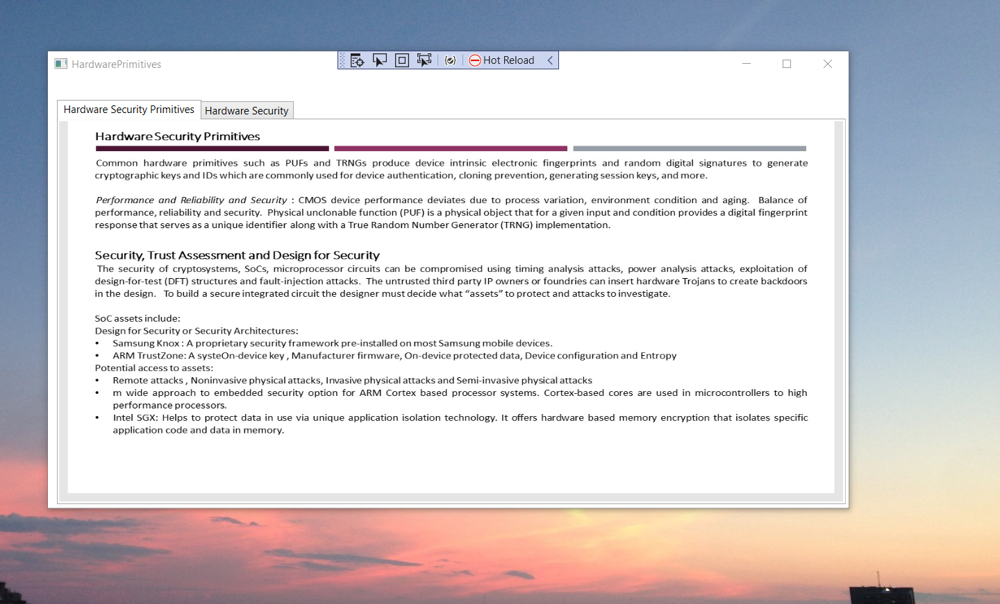

# Hardware Security

The project provides an introduction to hardware security.

Confidential information is not displayed. 

Please download the executable in https://github.com/alpaddesai/Hardware_Security/releases for details. 

All images are either custom by Alpa D Desai or a reference name is included. Most of the images are custom.

## Hardware Security 

## Hardware Trust

## Silicon-on-insulator

## Test Cost

## System-on-Chip Verification 

## Hardware Trojan

## Hardware Security Primitives

## Hardware Obfuscation

## Printed Circuit Board Authentication

## System-on-chip Security Requirements

## Radio Frequency Identification

